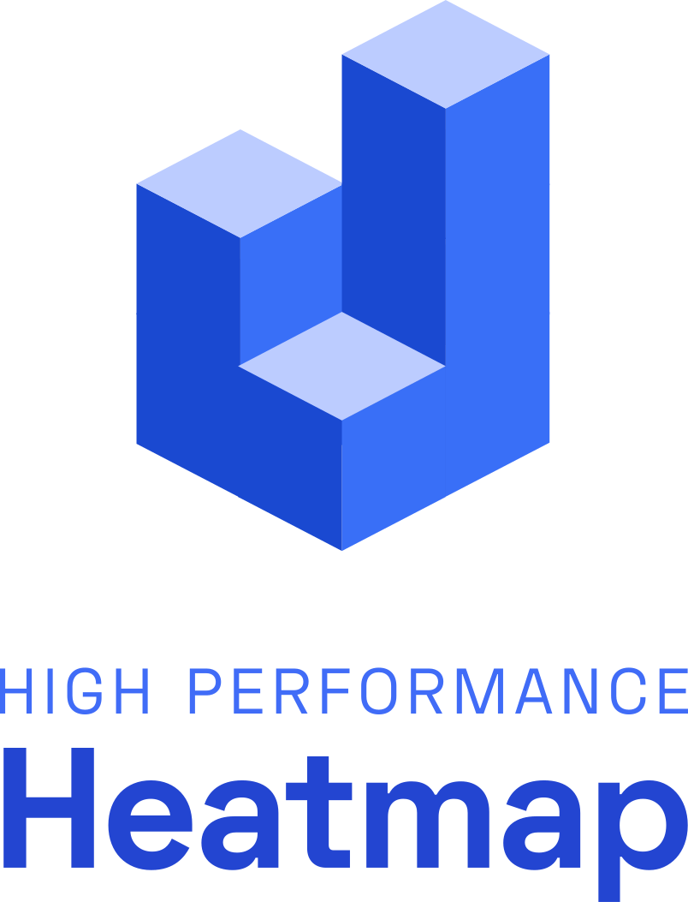

<p align="center">
 <a href=""></a>
</p>

## 2D & 3D Heatmap for visualizing >1,000,000 cells
WebGL based web-app with SVG export.
[PRE-RELEASE DEV]


# deck-gl-vue

## Project setup
```
npm install
```

### Compiles and hot-reloads for development
```
npm run serve
```

### Compiles and minifies for production
```
npm run build
```

### Lints and fixes files
```
npm run lint
```

### Customize configuration
See [Configuration Reference](https://cli.vuejs.org/config/).
